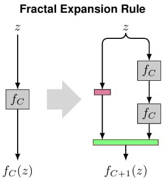
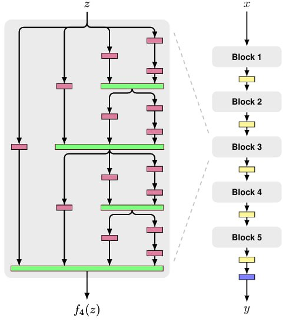
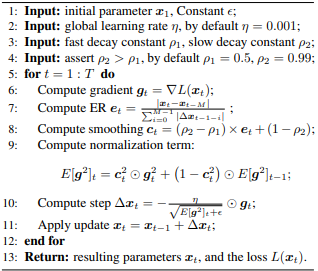
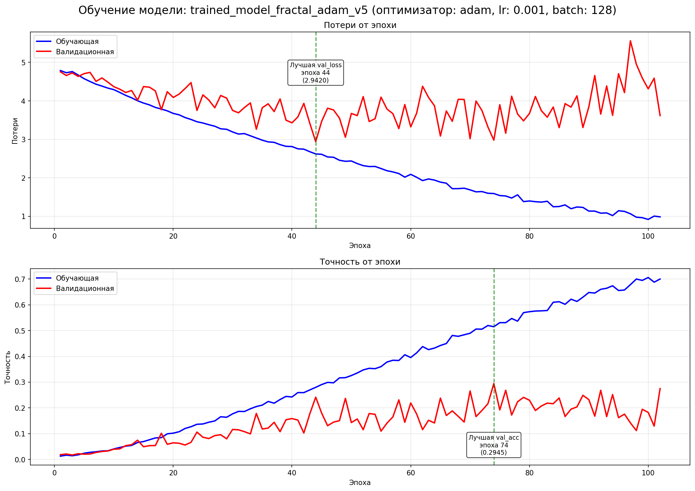
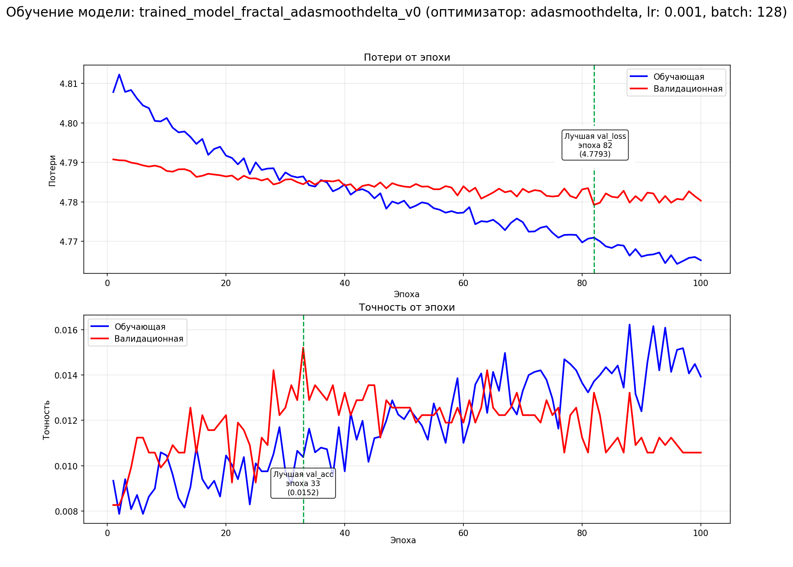

# FractalNet модель 

## Введение:
### Модель
FractalNet — это самоподобная нейросеть, построенная по фрактальному правилу расширения.
Вместо обычных линейных слоёв или резидуальных переходов (как в ResNet), FractalNet формирует множественные пути разной длины от входа к выходу, объединяя их на каждом уровне.

<p align="center">
  
</p>

Простое правило расширения формирует фрактальную архитектуру с _C_ переплетенными колонками. В базовом случае _f1(z)_, архитектура имеет один слой выбранного типа, между входом и выходом. Объединяющие слои рассчитывают среднее по элементам.

<p align="center">
  
</p>

Фрактальная сеть использует _fc_ как строительный блок между пуллинговыми слоями. При сложении _B_ таких блоков порождается сеть, чья общая глубина измеряется с точки зрения сверточных слоев равняется B · 2<sup>C-1</sup>.  В данном примере глубина 40 (_B_ = 5, _C_ = 4).   

### Оптимизатор AdaSmoothDelta
AdaSmoothDelta — это расширение метода AdaSmooth, в котором идея эффективного отношения (Effective Ratio, ER) применяется не только к накоплению квадратов градиентов, но и к накоплению квадратов самих шагов обновления параметров, аналогично AdaDelta.

Как и AdaDelta, данный оптимизатор полностью уходит от необходимости ручного задания глобального learning rate, используя соотношение между накопленными величинами обновлений и градиентов. Однако, в отличие от классического AdaDelta, AdaSmoothDelta вводит адаптивные коэффициенты сглаживания, зависящие от характера движения параметров.

Ключевая идея заключается в следующем:
- если параметр обновляется монотонно в одном направлении (ER → 1), используется короткое окно сглаживания, что ускоряет обучение;

- если обновления носят зигзагообразный характер (ER → 0), окно сглаживания автоматически расширяется, подавляя шум и стабилизируя шаги оптимизации.

Формально обновление имеет вид:

<p align="center">
  
</p>

___
## Подготовка окружения:
Для разработки данных скриптов использовалась python версии 3.12 и соответствующие библиотеки (без Torch и TorchVision):

- certifi==2025.11.12
- charset-normalizer==3.4.4
- colorama==0.4.6
- contourpy==1.3.3
- cycler==0.12.1
- filelock==3.20.0
- fonttools==4.61.0
- fsspec==2025.10.0
- idna==3.11
- Jinja2==3.1.6
- kiwisolver==1.4.9
- MarkupSafe==3.0.3
- matplotlib==3.10.7
- mpmath==1.3.0
- networkx==3.5
- numpy==2.3.5
- packaging==25.0
- pillow==12.0.0
- pyparsing==3.2.5
- python-dateutil==2.9.0.post0
- requests==2.32.5
- setuptools==80.9.0
- six==1.17.0
- sympy==1.14.0
- torch==2.9.1+cu130
- torchvision==0.24.1+cu130
- tqdm==4.67.1
- typing_extensions==4.15.0
- urllib3==2.5.0

### Установка библиотек Torch и TorchVision
Чтобы установить соответствующие версии torch и torchvision необходимо сверить версию CUDA поддерживаемой вашей видеокартой, 
по возможности обновить до последней доступной версии и уже после с официального сайта [PyTorch](https://pytorch.org/get-started/locally/)
установить необходимые библиотеки (последняя стабильная версия PyTorch требует Python 3.9). В моём случае RTX 5070 Ti поддерживает 13.0 версию CUDA и установку библиотек можно выполнить с помощью данной команды:

```bash
pip uninstall torch torchvision -y
pip install torch torchvision --index-url https://download.pytorch.org/whl/cu130
```

Если нет видеокарты или используется встроенный видеоускоритель, то установку библиотек можно выполнить уже с помощью данной команды:

```bash
pip uninstall torch torchvision -y 
pip install torch torchvision
```
___
## Структура проекта:
Проект состоит из нескольких скриптов для загрузки датасета, его обработки и обучения модели на нем. Проект:

- check_device.py - проверка аппаратных характеристик ЭВМ, для последующего обучения модели;
- download_stanford_dogs.py - cкачивает Stanford Dogs (images.tar, annotation.tar), распаковывает и делит по классам: 70% train / 15% evaluate / 15% test;
- model_runner.py - классификация одного изображения с помощью обученной модели FractalNet;
- model_trainer_v3.py - обучает модель FractalNet на датасете Stanford Dogs;
- plot_training_curves.py - создает графики потерь и точности от эпохи для конкретной модели. Сохраняет графики в формате PNG.

При запуске download_stanford_dogs.py будет сформировано несколько папок в корневой папке проекта:

- ./downloads - содержащий annotation.tar и images.tar. Сырые данные Stanford Dogs
- ./extracted - содержащий распакованные annotation.tar и images.tar
- ./input - содержащий сформированные выборки: 70% train / 15% evaluate / 15% test

При запуске model_trainer_v3.py будет сформировано несколько папок в корневой папке проекта:

- ./model - где будут обученные модели, их чекпоинты. Так же там будет файл metadata.json содержащий всю информацию об обученных моделях (гиперпараметры обучения, метрики качества модели, данные о процессе обучения)

___
## Результаты:

В ходе экспериментов была проведена серия обучений FractalNet на датасете Stanford Dogs с идентичной архитектурой и гиперпараметрами, но с разными оптимизаторами:
Adam (базовый ориентир) и AdaSmoothDelta (экспериментальный адаптивный оптимизатор).

### Результаты обучения с оптимизатором Adam
Оптимизатор Adam продемонстрировал устойчивую сходимость и ожидаемое поведение при обучении глубокой фрактальной архитектуры.

Ключевые наблюдения:

- модель уверенно снижает функцию потерь на обучающей выборке;
- наблюдается ограниченная, но стабильная обобщающая способность;
- характерная для Stanford Dogs проблема сильного межклассового перекоса проявляется в нулевой точности для отдельных пород.

Лучшие показатели:

- accuracy на валидации: ~29.5%
- accuracy на тесте: ~29.8%
- наилучший класс достигает точности ~69%
- худшие классы демонстрируют нулевую точность, что указывает на недостаточную специализацию признаков для отдельных пород.

График обучения отражает:

- уверенное снижение loss на train;
- раннюю стагнацию на validation и test;
- типичное поведение глубокой CNN без дополнительной регуляризации или data augmentation.

"model_id": "trained_model_fractal_adam_v5",
    "base_model": null,
    "optimizer": "adam",
    "epochs": 100,
    "batch_size": 128,
    "lr": 0.001,
    "C": 4,
    "channels": [
      32,
      64,
      96,
      128
    ],
    "classifier_dim": 256,
    "drop_path": 0.15,
"final": {
      "model_label": "final",
      "model_path": "model\\trained_model_fractal_adam_v5.pth",
      "train": {
        "loss": 1.0234496498888521,
        "acc": 0.6716126785092302,
        "per_class": [ ... ]
      },
      "val": {
        "loss": 3.6178103131696213,
        "acc": 0.2750413223140496,
        "per_class": [ ... ]
      },
      "test": {
        "loss": 3.4625853633880617,
        "acc": 0.2778125,
        "per_class": [ ... ]
      },
      "val_best_class": {
        "name": "n02091467-Norwegian_elkhound",
        "acc": 0.6896551724137931
      },
      "val_worst_class": {
        "name": "n02100735-English_setter",
        "acc": 0.0
      },
      "computed_at": "20251210_152207"
    },
"best_summary": {
      "model_label": "best",
      "model_path": "model\\best_model_fractal_adam_v5.pth",
      "train": {
        "loss": 1.6219269000790502,
        "acc": 0.5166840822013236,
        "per_class":  [ ... ]
      },
      "val": {
        "loss": 2.9801609972488783,
        "acc": 0.29454545454545455,
        "per_class":  [ ... ]
      },
      "test": {
        "loss": 2.895600290298462,
        "acc": 0.298125,
        "per_class":  [ ... ]
      },
      "val_best_class": {
        "name": "n02105505-komondor",
        "acc": 0.6956521739130435
      },
      "val_worst_class": {
        "name": "n02109047-Great_Dane",
        "acc": 0.0
      },
      "computed_at": "20251210_152233"
    }

<p align="center">
  
</p>

### Результаты обучения с оптимизатором AdaSmoothDelta

В конфигурации с оптимизатором AdaSmoothDelta модель не вошла в фазу эффективного обучения.

Наблюдаемое поведение:

- функция потерь остаётся близкой к случайному угадыванию;
- accuracy на всех выборках ≈ 1–1.5%, что соответствует равномерному распределению по классам;
- один из классов достигает высокой точности (до 100%), что указывает на коллапс оптимизации и фиксацию параметров под единичный класс.

"model_id": "trained_model_fractal_adasmoothdelta_v0",
    "base_model": null,
    "optimizer": "adasmoothdelta",
    "epochs": 100,
    "batch_size": 128,
    "lr": 0.001,
    "C": 4,
    "channels": [
      32,
      64,
      96,
      128
    ],
    "classifier_dim": 256,
    "drop_path": 0.15,
"final": {
      "model_label": "final",
      "model_path": "model\\trained_model_fractal_adasmoothdelta_v0.pth",
      "train": {
        "loss": 4.780464839536693,
        "acc": 0.01079763148728666,
        "per_class":  [ ... ]
      },
      "val": {
        "loss": 4.7803218171616235,
        "acc": 0.010578512396694216,
        "per_class":  [ ... ]
      },
      "test": {
        "loss": 4.7813976287841795,
        "acc": 0.0109375,
        "per_class":  [ ... ]
      },
      "val_best_class": {
        "name": "n02112018-Pomeranian",
        "acc": 1.0
      },
      "val_worst_class": {
        "name": "n02116738-African_hunting_dog",
        "acc": 0.0
      },
      "computed_at": "20251217_103539"
    },
    "best_summary": {
      "model_label": "best",
      "model_path": "model\\best_model_fractal_adasmoothdelta_v0.pth",
      "train": {
        "loss": 4.784884618741218,
        "acc": 0.013235806339254615,
        "per_class":  [ ... ]
      },
      "val": {
        "loss": 4.784470657001842,
        "acc": 0.015206611570247934,
        "per_class": [ ... ]
      },
      "test": {
        "loss": 4.785167179107666,
        "acc": 0.0159375,
        "per_class": [ ... ]
      },
      "val_best_class": {
        "name": "n02112018-Pomeranian",
        "acc": 0.59375
      },
      "val_worst_class": {
        "name": "n02116738-African_hunting_dog",
        "acc": 0.0
      },
      "computed_at": "20251217_103604"
    }

<p align="center">
  
</p>

___
## Характеристики вычислительной техники и ПО:
- Процессор: AMD Ryzen 7 7700, 8 ядер, 3.8 ГГц - 5.3 ГГц, L3 32 МБ
- Оперативная память: 16x4 Гб, 6000 МГц, 30 - 40 - 40
- Видеокарта: NVIDIA GeForce RTX 5070 Ti, 16Гб
- CUDA Version: 13.0

___
## Источники:
- Статья авторства Gustav Larsson, Michael Maire и Gregory Shakhnarovich [FRACTALNET:
ULTRA-DEEP NEURAL NETWORKS WITHOUT RESIDUALS](https://arxiv.org/pdf/1605.07648).
- Статья авторства Jun Lu [AdaSmooth: An Adaptive Learning Rate Method based on Effective Ratio](https://arxiv.org/pdf/2204.00825v1)

- Документация [PyTorch](https://docs.pytorch.org/docs/stable/index.html)

